# Courier system
## A full-stack courier system for managing parcel deliveries, courier tasks, customer support, notifications and role-based access control (customers, couriers, administrators)

---

## Tech Stack
|           | Technologies                                      |
|-------------|---------------------------------------------------|
| Backend     | Java, Spring Boot, Spring Security, JPA/Hibernate |
| Frontend    | Angular, TypeScript                               |
| Database    | MySQL                                             |
| Architecture | DDD, Hexagonal, Domain Events                     |
| Infrastructure | Docker, Docker Compose                            |

---

## Architecture

### System overview
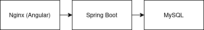

### Backend architecture
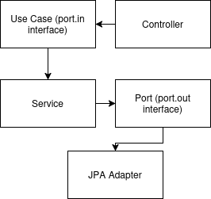

---

## Application preview

### Menu by role
<p>
    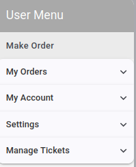
    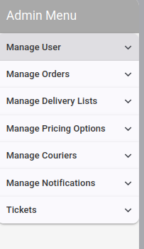
    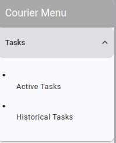
</p>

#### Role-based UI navigation for different roles

### Order Creation
<p>
    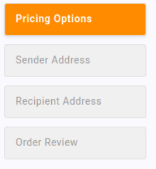
    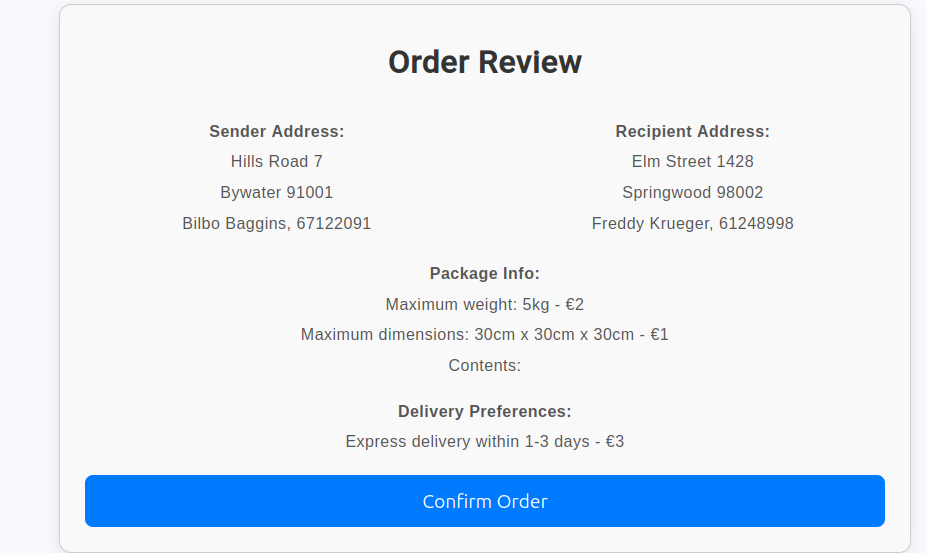
</p>

#### Multi-step order creation flow with structured input and final confirmation review

### Order Payment
<p> 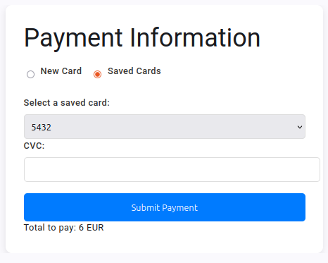</p>

#### Payment selection using saved or new card methods

### Task Creation
<p>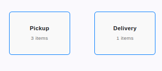</p>
<p>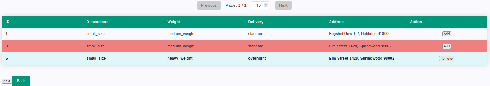</p>
<p>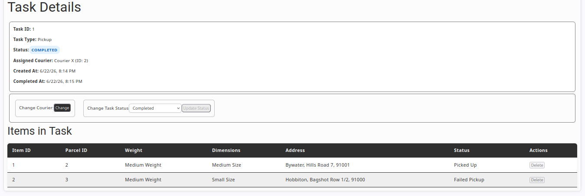</p>
#### Task lifecycle covering creation, item selection with failure tracking and final assignment view

### Task (courier)

<p>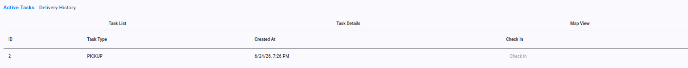 </p>
<p>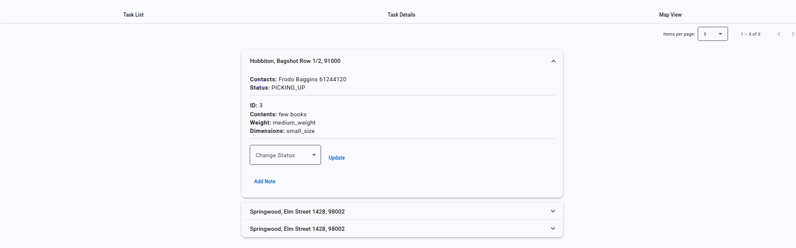 </p>

#### Courier task view for assigned tasks and detailed view with item updates

### Ticket (admin view)
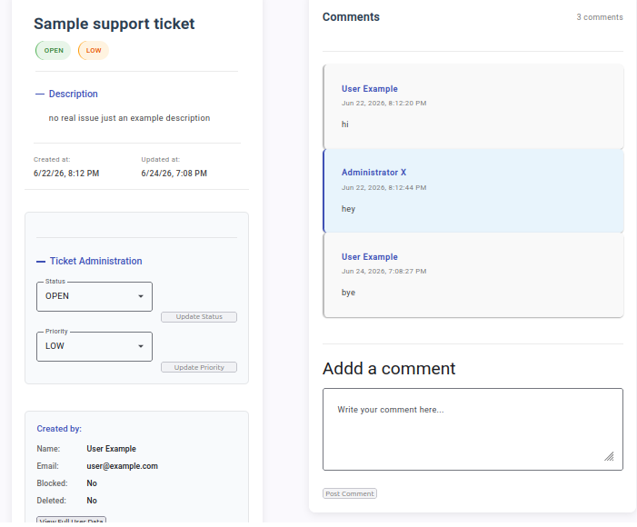

#### Support ticket system with comments and admin controls

---

## Features

### Customer
* Create delivery orders(parcel, address, delivery preferences)
* Manage payment methods(tokenized cc storage or one-time payments)
* View order history
* Create support tickets and comments

### Courier
* View assigned tasks
* Update task item statuses
* Add notes to items
* Check-in after completing assigned work

### Administrator
* Manage users and couriers
* Manage delivery options(parcel size, weight, delivery preferences)
* Create and assign tasks
* Manage orders(partial editing of each order section)
* Manage support tickets
* Send notifications (individual or role-based)

---

## Business Rules

### Task
* A task can be completed only when all task items are in final stage (success or failure)
* After courier check-in the admin finalize the task and parcel statuses are updated based on task item snapshots
* Task items store parcel snapshots to preserve historical consistency

### Notifications
* Role-based and user-specific notifications are supported
* System events like task assignment, courier check-in and parcel failures sends notifications to relevant users

### Payments
* Payment methods use token-based storage
* Saved cc's store only provider token, last4 and expiration date
* One-time payments store only transaction token

### Parcel Rules
* Parcels accumulate pickup and delivery failure counts
* After 3 failures admin alert is triggered requiring for manual intervention

---

## Security
* JWT-based authentication with access and refresh tokens
* Tokens stored in HttpOnly cookies
* Stateless Spring Security with filter-based authentication
* Role-based authorization using Spring Security

---

## Running the Application

### Requirements
* Docker
* Docker Compose

### Setup
1. Copy '.env.example' to '.env'
2. Fill the required environment variables
3. Generate a minimum 32 characters 'JWT_SECRET';

### Start

```bash
docker compose up --build
```

### Application URLs

|          | URL |
|----------|-----|
| Frontend | http://localhost:4200 |
| Backend  | http://localhost:8080 |

---

## Demo Accounts

### Demo accounts data loads on first run.
| Role    | Email | Password |
|---------| ----- | -------- |
| Admin   | admin@example.com | pass123 |
| Courier | courier@example.com | pass123 |
| User | user@example.com | pass123 |

---
